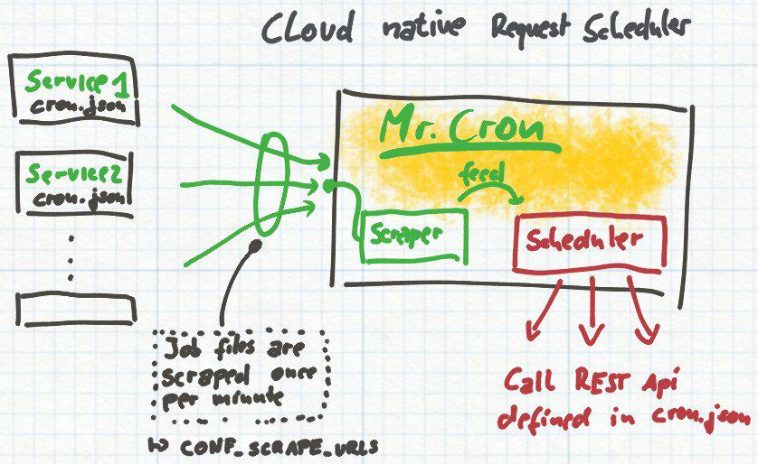

# Mr. Cron Cloud Cron Scheduler

Cloud ready cron scheduler service. Mr. Cron will scrape multiple urls for cronjob data and
execute (call desired urls). No additional services are needed.



## Installation / Running MrCron

Just run the publicly available on dockerhub:

```
docker run -e "CONF_SCRAPE_URLS=http://xy/mrcron.json" infracamp/mrcron
```

- [How to run MrCron on docker stack](docs/docker-stack-mrcron.yml)
- How to run MrCron on kubernetes


## Configuration

### Environment

**CONF_SCRAPE_URLS**

The urls to scrape for jobdef.json content. Multiple URLs can be specified
separated by semicolon.

### MrCron jobdef.json

```json
{
  "jobs": [
    {
      "id": "Unique job identifier",
      "cron": "<cron timing def>",
      "urls": [
        "http://some.tld/to/call"  
      ]   
    },
    ..next job..
  ]
}
```

### Cron timing def

```
* * * * *
┬ ┬ ┬ ┬ ┬
│ │ │ │ │
│ │ │ │ └──── Weekday (0-7, Sunday is 0)
│ │ │ └────── Month (1-12)
│ │ └──────── Day (1-31)
│ └────────── Hour (0-23)
└──────────── Minute (0-59)
```

**Examples**

```* * * * *```: Run the job each minute

```0 * * * *```: Will run the job once per hour at xx:00

```0 0 * * *```: Run the job daily at Midnight (00:00)

```0 0 1 * *```: Run the job on Midnight (00:00) on first day of the month

```0 0 * * 0```: Run the job on Midnight (00:00) on each Sunday (0 => Sunday)
